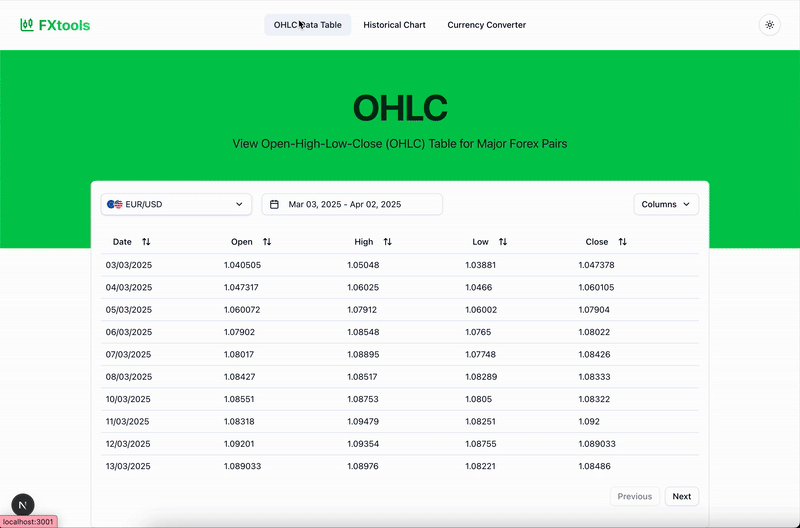

# Forex Tools - Next.js Website



## 💡 Why I Built This Project

After several years working in Forex Fintech, I felt inspired to develop some tools using a modern front-end tech stack:

- Explore ShadCn components and the modern UI capabilities of NextJS and ReactJS
- Experiment with dark/light theme toggling for improved user experience
- Evaluate the efficiency of TanStack Data Table and Recharts for data visualization

This project serves as both a practical tool for currency trend analysis and a playground for modern web development techniques.

_Important: This project is a technical demo only. All market data is for illustration purposes—no trading functionality is included or recommended._

## 📊 Project Overview

This is a professional-grade Forex analytics platform that features real-time currency data, historical trend visualization, and OHLC metrics. It’s built with modern web technologies and supports both dark and light modes, so you can switch to your preferred viewing style easily.


## ✨ Key Features

- **Real-time Currency Conversion**
- **Interactive Historical Charts** with customisable date ranges
- **Institutional-style OHLC Tables** for major Forex pairs
- **Secure API Architecture** that meets financial data standards
- **Responsive Design** that looks great on both dark and light mode

## 📂 Project Structure

```
└── 📁app
    ├── 📁currency-converter          # Real-time conversion tool
    │   └── page.tsx                 # Main converter logic
    │
    ├── 📁historical                 # Historical data charts
    │   ├── 📁components             # Chart-specific components
    │   │   ├── chart.tsx            # Recharts implementation
    │   │   └── data-filters.tsx     # Date/currency selectors
    │   └── page.tsx                 # Historical data page
    │
    ├── 📁ohlc                       # OHLC data tables
    │   ├── 📁components             # Table components
    │   │   ├── columns.tsx          # Column definitions
    │   │   ├── filters.tsx          # Pair selection
    │   │   └── table.tsx            # Data table implementation
    │   ├── constants.ts             # Currency pair constants
    │   └── page.tsx                 # OHLC page
    │
    └── 📁components                 # Shared UI components
        ├── 📁ui                     # shadcn/ui components
        ├── chart.tsx                # Recharts wrapper
        ├── currency-selector.tsx    # Currency dropdown
        └── hero.tsx                 # Page headers
```

**Quick Structure Notes:**

- The `/app` folder contains route groups following Next.js 13+ conventions.
- The `/components` folder holds reusable UI components shared across the site.
- Each feature has its own components folder to keep specialized logic organized.
- TypeScript is used throughout to ensure type safety.

## 🔑 API Requirements

This project uses API keys from providers that offer free tiers:

| Provider                                        | Use Case        | Free Tier Limits |
| ----------------------------------------------- | --------------- | ---------------- |
| [Frankfurter.app](https://www.frankfurter.app/) | Live rates      | 1,000 reqs/month |
| [ForexRateAPI](https://www.forexrateapi.com/)   | Historical data | 1,000 reqs/month |
| [Twelve Data](https://twelvedata.com/)          | OHLC metrics    | 8 reqs/day       |

_Note: The project shows clear error handling when keys aren't set up._

## 💻 Technology Stack


**Key Technologies:**

- **Next.js 14**: Great for server-side rendering and financial data display.
- **shadcn/ui**: Professional and accessible UI components.
- **TypeScript**: Ensures reliable financial calculations.
- **Recharts**: Powerful visualizations for financial data.
- **date-fns**: Handles date operations reliably.

## 🚀 Installation & Setup

### Prerequisites

- Node.js v18+
- Your favorite package manager (npm, yarn, or pnpm)
- API keys from the providers mentioned above

### Setup Steps

1. **Clone the Repository**

   ```bash
   git clone https://github.com/your-username/forex-tools.git
   cd forex-tools
   ```

2. **Install Dependencies**

   ```bash
   npm install  # or yarn/pnpm equivalent
   ```

3. **Configure Your Environment**

   ```bash
   cp .env.example .env.local
   ```

   Then, edit `.env.local` to include your API keys:

   ```env
   # For OHLC data
   NEXT_PUBLIC_TWELVE_DATA_API_KEY=your_key_here

   # For historical data
   NEXT_PUBLIC_FOREX_API_KEY=your_key_here

   # Frankfurter.app is free to use
   ```

4. **Run the Development Server**

   ```bash
   npm run dev
   ```

   Visit: `http://localhost:3000`

5. **Build for Production (optional)**
   ```bash
   npm run build
   npm start
   ```

### Development Tips

- Enjoy hot reloading during development.
- Helpful error messages will show up in the UI if API keys are missing or other issues occur.
- Your `.env.local` file is git-ignored, so your API keys stay safe.
- Consider using `npm ci` in CI/CD environments.

## ⚠️ Important Considerations

1. **Data Limitations**

   - Free API tiers come with strict rate limits.
   - Historical data may be delayed by about 15 minutes.
   - Always verify critical rates with official sources.

2. **Security Best Practices**

   ```bash
   # Always ignore environment files in your repository
   echo ".env*" >> .gitignore
   ```

3. **Production Deployment**

   - Set proper caching headers.
   - Implement rate limiting.
   - Monitor your API usage.

## 🛠️ Troubleshooting

**Common Issues:**

1. **Missing Data**

   - Double-check your API keys in `.env.local`.
   - Verify provider status on their websites.
   - Look at your browser’s console for errors.

2. **Chart Rendering Issues**

   ```jsx
   <Suspense fallback={<LoadingSkeleton />}>
     <HistoricalChart />
   </Suspense>
   ```

3. **API Limit Errors**

   - Use client-side caching.
   - Reduce unnecessary re-fetching.
   - Consider upgrading your API plan if needed.

## 📜 License

MIT License - This project is for educational purposes only. It does not provide financial advice.

---

**Friendly Reminder:**  
This project is a demo built to share technical skills and ideas. It comes with both dark and light mode options so you can choose the look that suits you best. Remember, it’s not financial advice—always talk to a licensed financial advisor before making any trading decisions.
